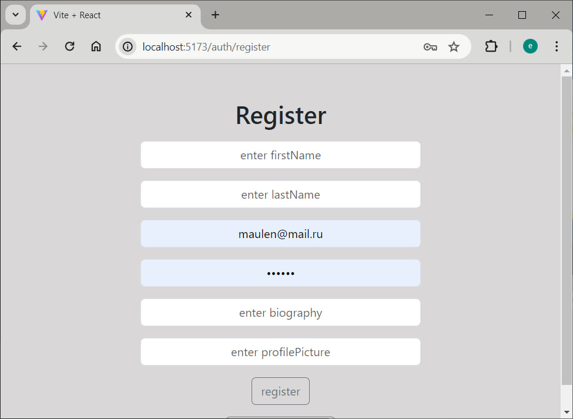
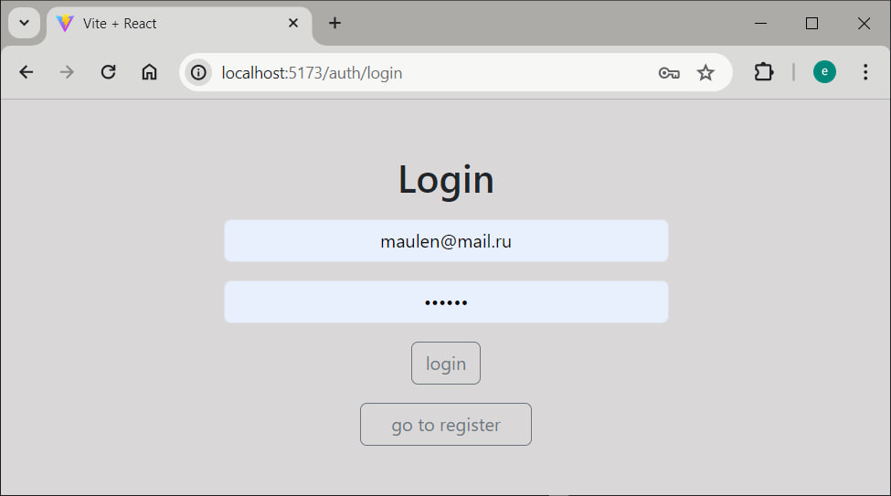
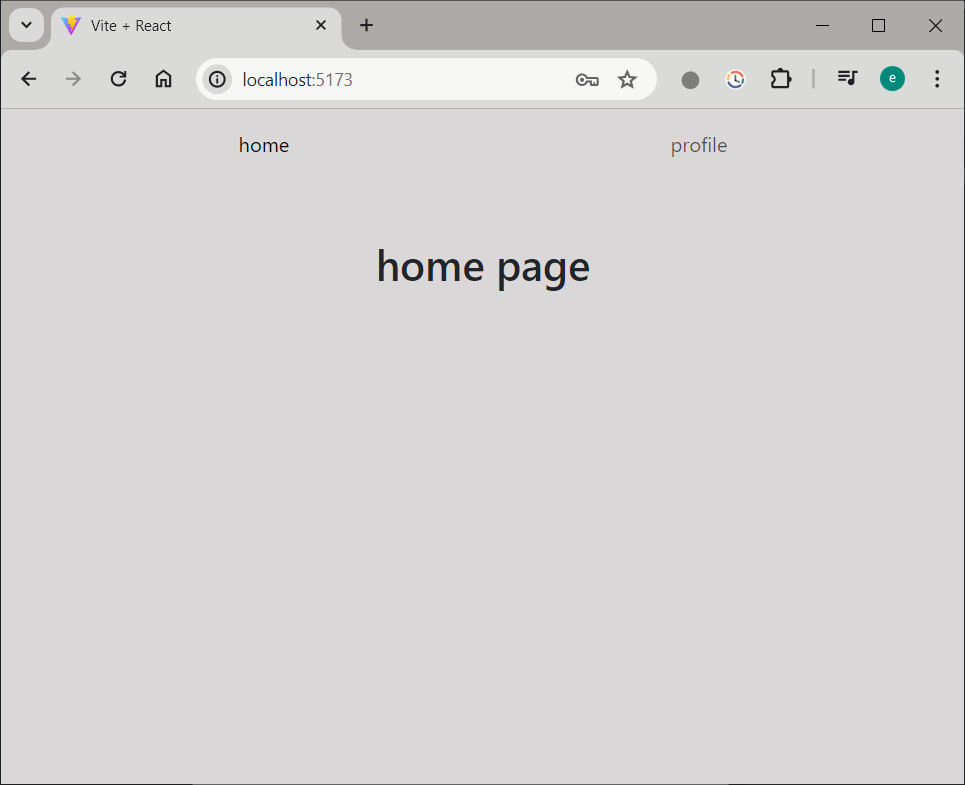
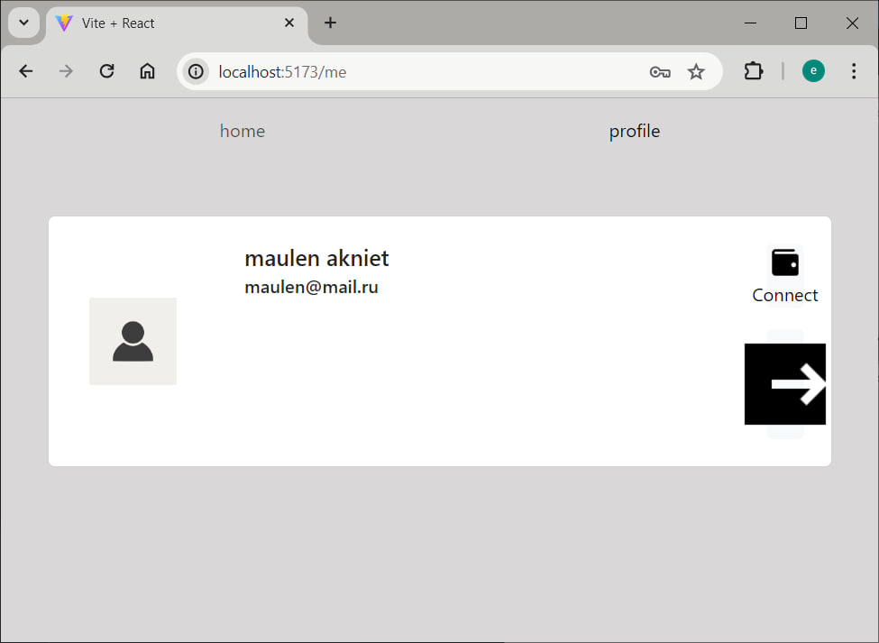
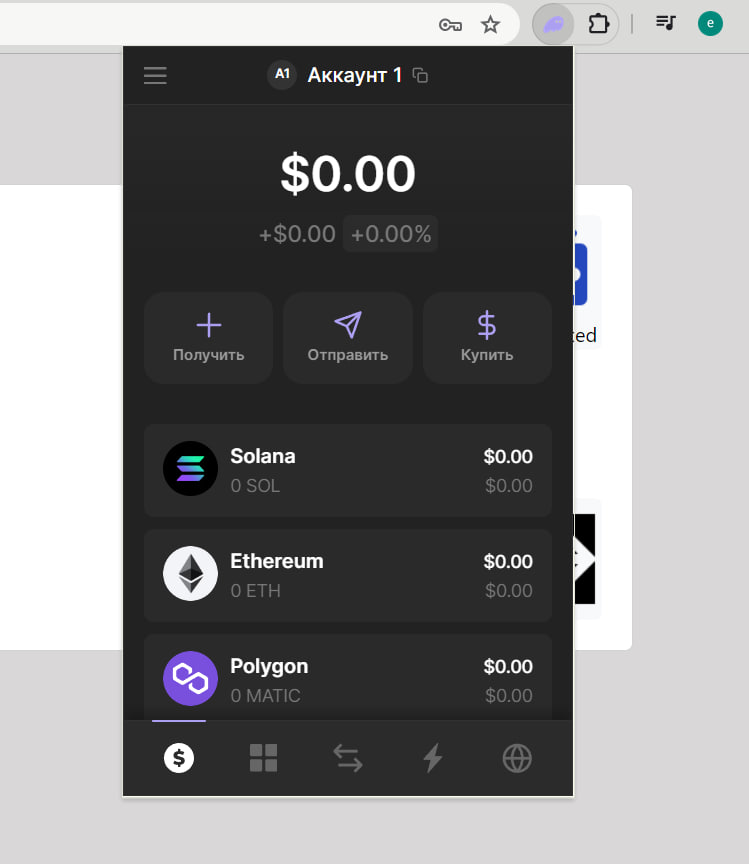

    Blockchain assignment 3

This is a project consisting of a React client and an Express server.

## Running the Application

### Prerequisites

- Node.js and npm installed on your machine.

### Installation

1. Clone this repository.

```
git clone https://github.com/musstafina/Blockchain2
```

2. Navigate to the project directory.

```
cd Blockchain2
```

### Server Setup

1. Navigate to the `server` directory.

```
cd server
```

2. Run `npm install` to install dependencies.

```
npm install
```

3. Once the installation is complete, run `npm start` to start the Express server.

```
node app.js
```

4. The server will be running on `http://localhost:6600` by default.

### Client Setup

1. Open new terminal and navigate to the `client` directory.

```
cd client
```

2. Run `npm install` to install dependencies.

```
npm install
```

3. Once the installation is complete, run `npm run dev` to start the React development server.

```
npm run dev
```

4. The client will be running on `http://localhost:5173` by default.

### Viewing Site Pages

#### Register page



#### Login page



#### Home page



#### Profile page



#### Blockchain wallet


